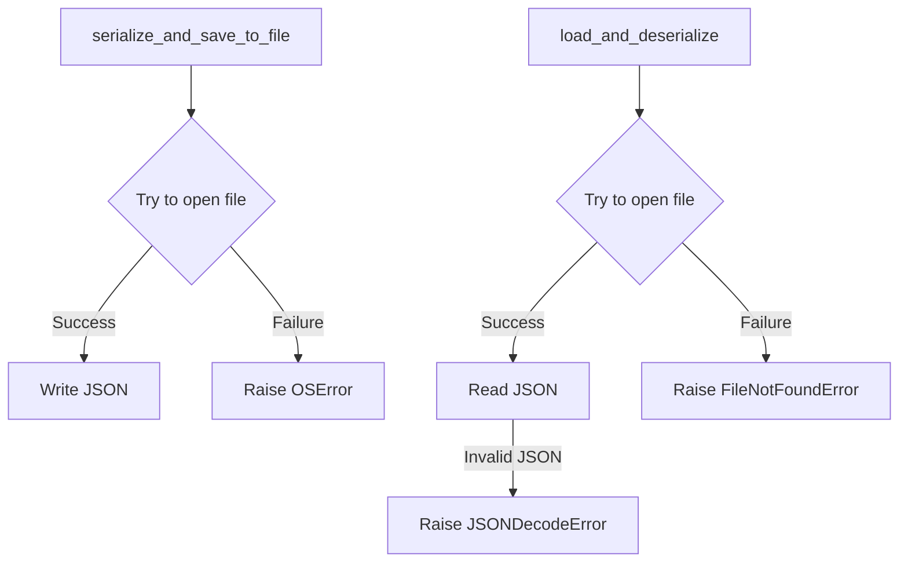

```mermaid
flowchart TD
    A[serialize_and_save_to_file] --> B{Try to open file}
    B -->|Success| C[Write JSON]
    B -->|Failure| D[Raise OSError]
    
    E[load_and_deserialize] --> F{Try to open file}
    F -->|Success| G[Read JSON]
    F -->|Failure| H[Raise FileNotFoundError]
    G -->|Invalid JSON| I[Raise JSONDecodeError]
```