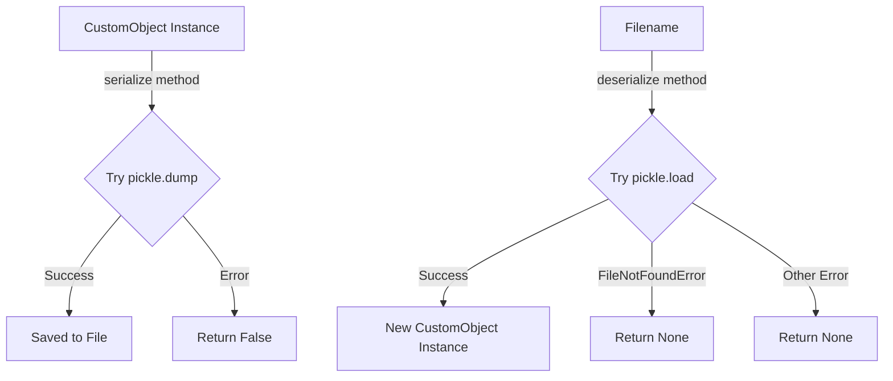

```mermaid
flowchart TD
    A[CustomObject Instance] -->|serialize method| B{Try pickle.dump}
    B -->|Success| C[Saved to File]
    B -->|Error| D[Return False]
    
    E[Filename] -->|deserialize method| F{Try pickle.load}
    F -->|Success| G[New CustomObject Instance]
    F -->|FileNotFoundError| H[Return None]
    F -->|Other Error| I[Return None]
```