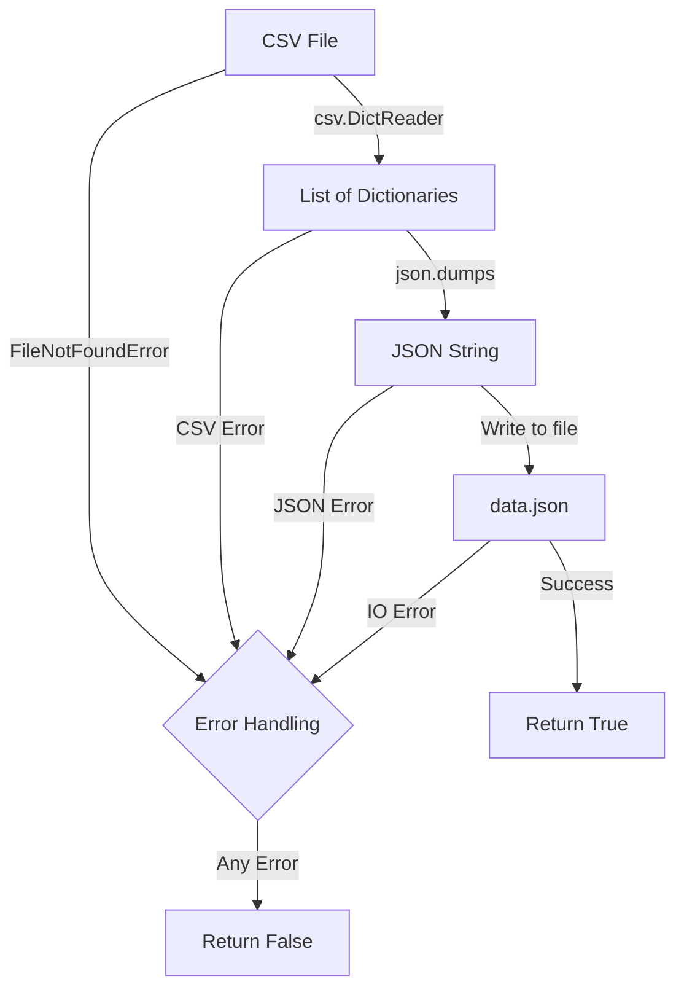

```mermaid
flowchart TD
    A[CSV File] -->|csv.DictReader| B[List of Dictionaries]
    B -->|json.dumps| C[JSON String]
    C -->|Write to file| D[data.json]
    
    E{Error Handling}
    A -->|FileNotFoundError| E
    B -->|CSV Error| E
    C -->|JSON Error| E
    D -->|IO Error| E
    
    E -->|Any Error| F[Return False]
    D -->|Success| G[Return True]
```