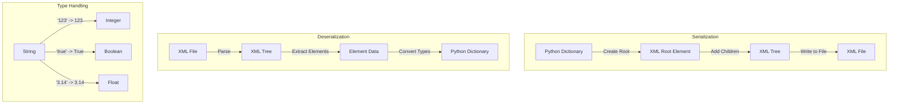

```mermaid
flowchart TD
    subgraph Serialization
        A[Python Dictionary] -->|Create Root| B[XML Root Element]
        B -->|Add Children| C[XML Tree]
        C -->|Write to File| D[XML File]
    end
    
    subgraph Deserialization
        E[XML File] -->|Parse| F[XML Tree]
        F -->|Extract Elements| G[Element Data]
        G -->|Convert Types| H[Python Dictionary]
    end
    
    subgraph Type Handling
        I[String] -->|"'123' -> 123"| J[Integer]
        I -->|"'true' -> True"| K[Boolean]
        I -->|"'3.14' -> 3.14"| L[Float]
    end
```